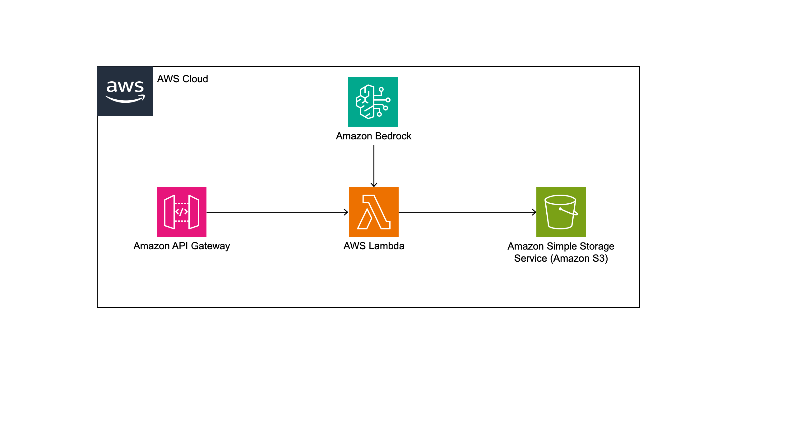
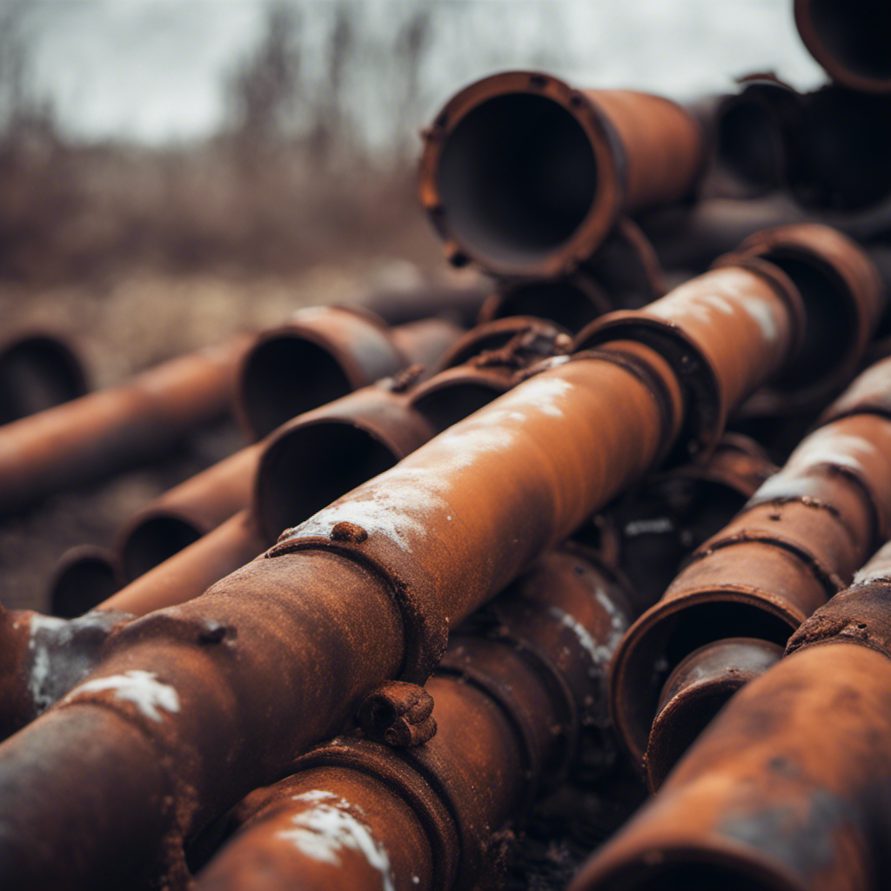

# Geração de imagem usando ApiGateway, Lambda, Bedrock e S3



## Instruções de deploy

1. Crie um ambiente virtual em Python
    ```
    python3 -m venv .venv
    ```
    Para Windows:
    ```
    .venv\Scripts\activate.bat
    ```
    Para Linux:
    ```
    source .venv/bin/activate
    ```
1. Instale as dependências:
    ```
    pip install -r requirements.txt
    ```
1. Execute o bootstrap
    ```
    cdk bootstrap
    ```
1. Revise o template gerado pelo CDK:
    ```
    cdk synth
    ```
1. Execute o deploy.
    ```
    cdk deploy
    ```
1. Após finalziar o deploy, observe a saída no terminal. Haverá uma URL do recurso da API Gateway que deve ser chamado. Copie a URL para executar os testes.

    O formato de saída é: `https://{id}.execute-api.{region}.amazonaws.com/prod`

## Testes

    ```
    curl -X POST \
    {your-api-url}/prod/image_gen \
    -H "Content-Type: application/json" \
    -d '{"prompt": "Rusted oil pipeline weathered, damaged, old"}'
    ```

## Resultados

Acesse o bucket na Amazon S3, e veja as imagens em `image-{num}.png`. 

Veja exemplo de imagem gerada:


## Limpeza
 
1. Execute o comando abaixo no diretório do projeto para deletar os recursos da AWS que foram criados pela stack.
    ```bash
    cdk destroy
    ```